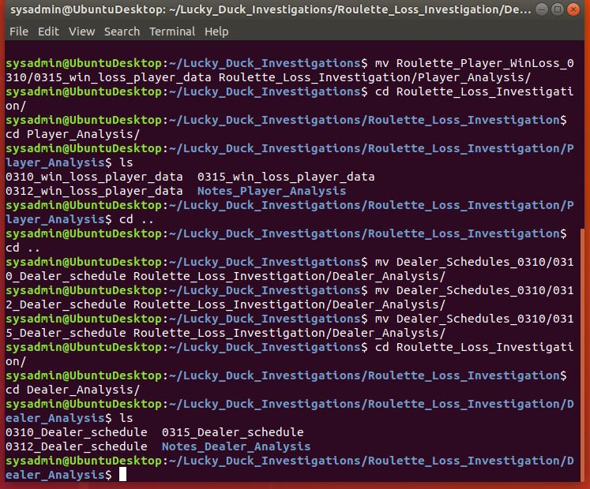
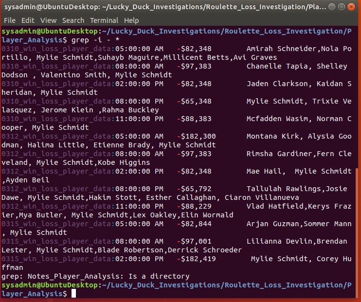

A High Stakes Investigation

Scenario
You have just been hired by Lucky Duck Casino as a security analyst.
Lucky Duck has lost a significant amount of money on the roulette tables over the last month.
The largest losses occurred on March 10, 12, and 15.
Your manager believes there is a player working with a Lucky Duck dealer to steal money at the roulette tables.
The casino has a large database with data on wins and losses, player analysis, and dealer schedules.
You are tasked with navigating, modifying, and analyzing these data files to gather evidence on the rogue player and dealer.
You will prepare several evidence files to assist the prosecution.
You must work quickly as Lucky Duck can't afford any more losses.
Lucky Duck Casino has provided you with the following files if required:

Roulette Player Data: Week of March 10
Employee Dealer Schedule: Week of March

Instructions
Use your command-line skills to uncover the identities of the rogue casino player and dealer colluding to scam Lucky Duck out of thousands of dollars.

### Investigation Preparation
 I created directory by using mkdir command
 Begin by making a single directory titled Lucky_Duck_Investigations. 
 where i created few more directories to start my investigation.

In this directory, create a directory for this specific investigation titled Roulette_Loss_Investigation.
In Roulette_Loss_Investigation, create the following directories:
Player_Analysis to investigate the casino player.
Dealer_Analysis to investigate the dealers.
Player_Dealer_Correlation to summarize your findings of the collusion.
Create empty files called Notes_<Directory Name> under each subdirectory to store investigation notes.
For example: Notes_Player_Analysis

- 

### Gathering Evidence
Your next task is to move evidence from the specific days that Lucky Duck experienced heavy losses at the roulette tables 
Lucky_Duck_Investigations: Contains the investigation directories and notes files I created.
Roulette_Player_WinLoss_0310: Contains the data for player wins and losses.
The Dealer_Schedules_0310 and Roulette_Player_WinLoss_0310 directories contain the dealer schedules and win/loss player data from the roulette tables during the week of March 10.
Since the losses occurred on March 10, 12, and 15, move the schedules for those days into the directory Dealer_Analysis.
Move the files for those days into the directory Player_Analysis.

- 

### Correlating the Evidence

Your next task is to correlate the large losses from the roulette tables with the dealer schedule. This will help you determine which dealer and player are colluding to steal money from Lucky Duck.
Note: Winnings for Lucky Duck Casino are indicated with a positive number and losses are indicated with a negative number.
Complete the player analysis.
Navigate to the Player_Analysis directory.
Use grep to isolate all of the losses that occurred on March 10, 12, and 15.
Place those results in a file called Roulette_Losses.
Preview the file Roulette_Losses and analyze the data.

- 

- 

Record in the Notes_Player_Analysis file:

The times the losses occurred on each day.
If there is a certain player that was playing during each of those times.
The total count of times this player was playing.

- 

# Complete the dealer analysis.

# Navigate to the Dealer_Analysis directory.

This file contains the dealer schedules for the various Lucky Duck casino games: Blackjack, Roulette, and Texas Hold 'Em.
Using your findings from the player analysis, create a separate script to look at each day and time that you determined losses occurred. Use awk, pipes, and grep to isolate out the following four fields:

Time
a.m./p.m.
First name of roulette dealer
Last name of roulette dealer

- 

For example, if a loss occurred on March 10 at 2 p.m., you would write one script to find the roulette dealer who was working at that specific day and time.
Run all of the scripts and append those results to a file called Dealers_working_during_losses.

- 

Preview your file Dealers_working_during_losses and analyze the data.
The primary dealer working at the times where losses occurred.

How many times the dealer worked when major losses occurred.
Complete the player/employee correlation.

- 

In the notes file of the Player_Dealer_Correlation directory, add a summary of your findings noting the player and dealer you believe are colluding to scam Lucky Duck.
Make sure to document your specific reasons for this finding.

- 

### Step 4: Scripting Your Tasks

You manager is impressed with the work you have done so far on the investigation.
They tasked you with building a shell script that can easily analyze future employee schedules. They will use this to determine which employee was working at a specific time in the case of future losses.
Complete the following tasks:

Remain in the Dealer_Analysis directory.  Develop a shell script called roulette_dealer_finder_by_time.sh 

- 

that can analyze the employee schedule to easily find the roulette dealer at a specific time.
Hint: You will be using a script similar to the one you created for the dealer analysis step, but you will not output the results into a file.

Design the shell script to accept the following two arguments:
One for the date (four digits)
One for the time
Note: The argument should be able to accept a.m. or p.m.
Test your script on the schedules to confirm it outputs the correct dealer at the time specified.

- 

### Bonus
In case there is future fraud on the other Lucky Duck games, create a shell script called roulette_dealer_finder_by_time_and_game.sh that has the three following arguments:
Specific time
Specific date
Casino game being played

- 

- 

### Submission Guidelines

Move the following to the Player_Dealer_Correlation directory:

All note files
Evidence files:
Roulette_Losses
Dealers_working_during_losses
Shell script(s)
Compress the Player_Dealer_Correlation folder to a zip file and submit it.

- 

- ! [zip command](./Image/image_14.png)
